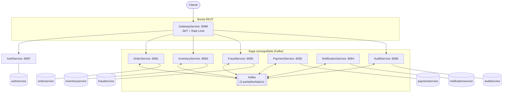
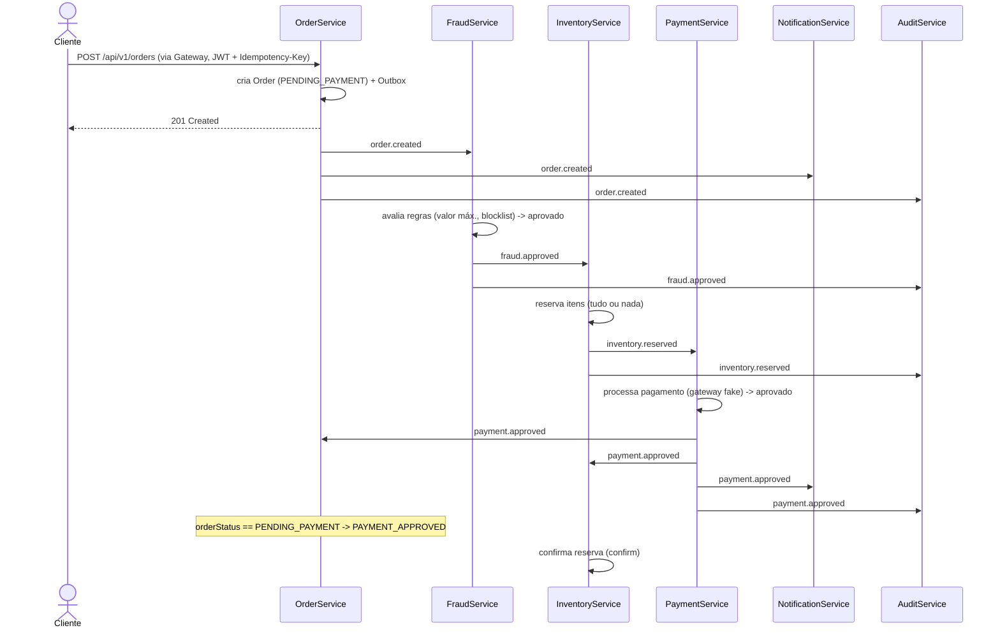
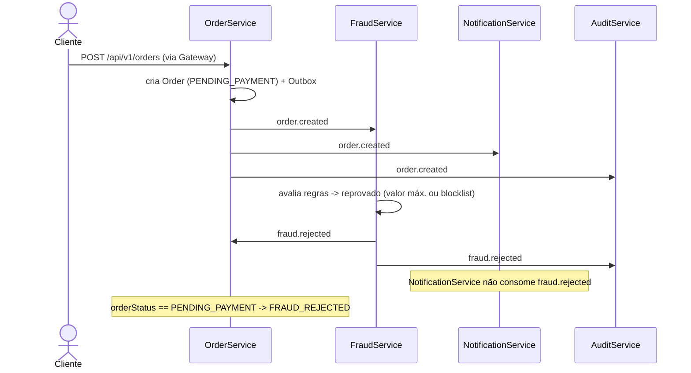
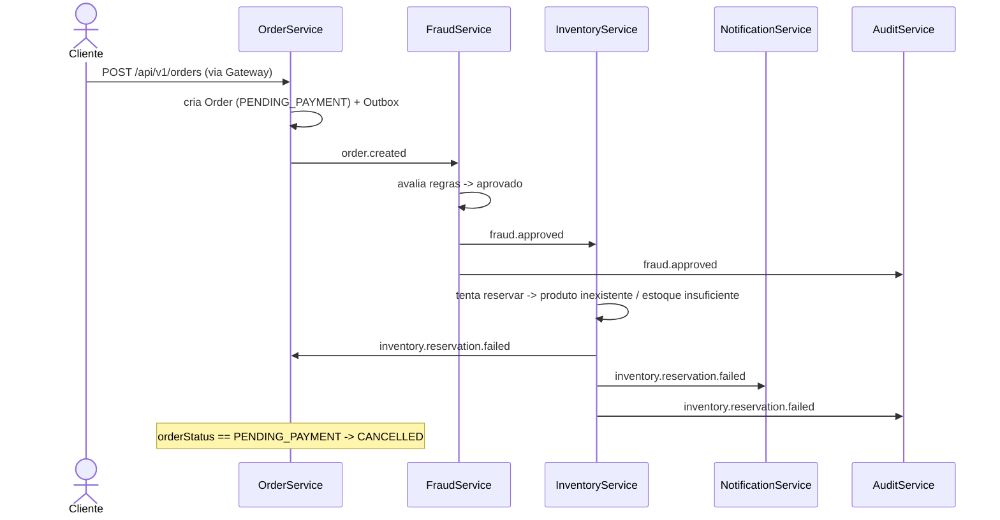
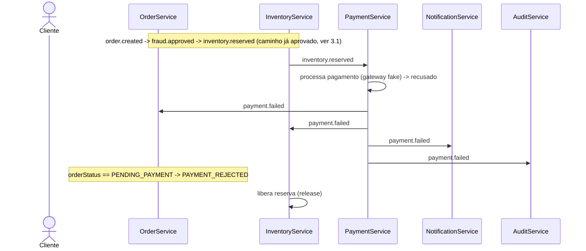
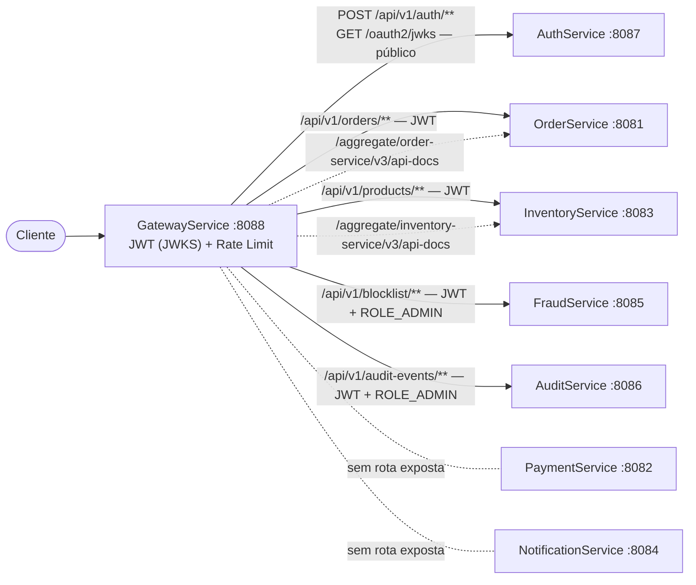
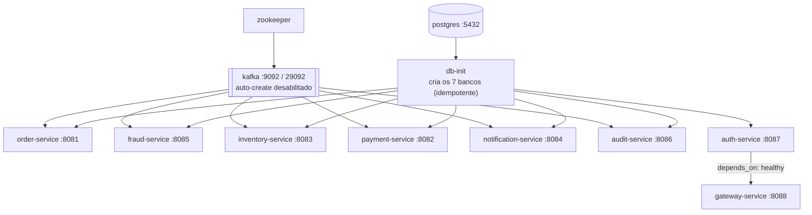

# Visão geral de arquitetura e fluxo

Documento de referência para entendimento/onboarding da plataforma **LmfEventDrivenPlatform** — não é normativo nem registra decisões (isso é papel das [ADRs](../adr/README.md)). Este documento consolida, com diagramas, o que já está descrito em texto no [`CLAUDE.md`](../../CLAUDE.md) e no [`README.md`](../../README.md) raiz.

## Índice

1. [Visão geral dos serviços](#1-visão-geral-dos-serviços)
2. [Diagrama de componentes](#2-diagrama-de-componentes)
3. [Fluxo da saga (diagramas de sequência)](#3-fluxo-da-saga-diagramas-de-sequência)
4. [Tópicos Kafka](#4-tópicos-kafka)
5. [Borda REST (Auth + Gateway)](#5-borda-rest-auth--gateway)
6. [Padrões da plataforma](#6-padrões-da-plataforma)
7. [Infraestrutura e deployment](#7-infraestrutura-e-deployment)
8. [Referências](#8-referências)

## 1. Visão geral dos serviços

| Serviço | Porta | Banco | Papel |
|---|---|---|---|
| **OrderService** | 8081 | `orderservice` | Cria o pedido e fecha a saga (aprovado, recusado por pagamento, cancelado por estoque ou rejeitado por fraude) |
| **FraudService** | 8085 | `fraudservice` | Avalia regras antifraude (valor máximo configurável, blocklist por `customerId`/e-mail) e decide se o pedido segue |
| **InventoryService** | 8083 | `inventoryservice` | Reserva estoque (tudo ou nada), confirma ou libera a reserva conforme o desfecho do pagamento |
| **PaymentService** | 8082 | `paymentservice` | Processa o pagamento via gateway fake |
| **NotificationService** | 8084 | `notificationservice` | Consumidor terminal da coreografia: notifica o cliente, entrega best-effort, não produz eventos |
| **AuditService** | 8086 | `auditservice` | Consumidor terminal: grava trilha de auditoria append-only dos 7 tópicos da saga, não produz eventos |
| **AuthService** | 8087 | `authservice` | Cadastro/login e emissão de JWT RS256 stateless; publica o JWKS |
| **GatewayService** | 8088 | — (sem banco) | Ponto único de entrada: roteamento, validação de JWT, rate limit, agregação de OpenAPI |

AuthService e GatewayService são REST-only e ficam fora do tema event-driven (sem Kafka, sem `platform-contracts`/`platform-messaging`) — ver [ADR 0007](../adr/0007-authservice-jwt-stateless-rsa-jwks.md) e [ADR 0008](../adr/0008-gateway-borda-jwt-webmvc-ratelimit-openapi.md).

## 2. Diagrama de componentes

Note que **PaymentService** e **NotificationService** não recebem seta a partir do `Gateway`: não têm rota exposta na borda, só são acessados via Kafka.

## 3. Fluxo da saga (diagramas de sequência)

Todas as transições de status em `OrderSagaConsumer` só se aplicam quando `orderStatus == PENDING_PAYMENT` — idempotência por estado do agregado (ver [ADR 0003](../adr/0003-inbox-vs-idempotencia-por-estado.md)), o que garante que a saga feche uma única vez mesmo com reentrega de mensagens.

### 3.1 Caminho aprovado

### 3.2 Rejeitado por fraude

### 3.3 Falha na reserva de estoque

Não há reserva parcial: se qualquer item falhar, nenhuma reserva é persistida.

### 3.4 Pagamento recusado

## 4. Tópicos Kafka

| Tópico | Produtor (use case) | Consumidor(es) — group id |
|---|---|---|
| `order.created` | OrderService — `CreateOrderUseCase` | FraudService (`fraud-service-group`), NotificationService (`notification-service-group`), AuditService (`audit-service-group`) |
| `fraud.approved` | FraudService — `EvaluateFraudService` | InventoryService (`inventory-service-group`), AuditService (`audit-service-group`) |
| `fraud.rejected` | FraudService — `EvaluateFraudService` | OrderService (`order-service-group`), AuditService (`audit-service-group`) |
| `inventory.reserved` | InventoryService — `ReserveInventoryService` | PaymentService (`payment-service-group`), AuditService (`audit-service-group`) |
| `inventory.reservation.failed` | InventoryService — `ReserveInventoryService` | OrderService (`order-service-group`), NotificationService (`notification-service-group`), AuditService (`audit-service-group`) |
| `payment.approved` | PaymentService — `PaymentEventService` | OrderService (`order-service-group`), InventoryService (`inventory-service-group`), NotificationService (`notification-service-group`), AuditService (`audit-service-group`) |
| `payment.failed` | PaymentService — `PaymentEventService` | OrderService (`order-service-group`), InventoryService (`inventory-service-group`), NotificationService (`notification-service-group`), AuditService (`audit-service-group`) |

Todos os tópicos têm 3 partições (`KAFKA_AUTO_CREATE_TOPICS_ENABLE=false`; criados só pelos beans `NewTopic` de cada `KafkaTopicsConfig`). Estratégias de retry/DLT na [seção 6](#6-padrões-da-plataforma).

## 5. Borda REST (Auth + Gateway)

- **Emissão do token**: `AuthService` assina o JWT com RS256 (`NimbusJwtEncoder`), claims `sub` (username), `roles` (já prefixado `ROLE_...`), `email`, `iat`/`exp`/`jti`. Par de chaves RSA gerado no startup (ou vindo de `auth.jwt.public-key`/`private-key`).
- **Validação na borda**: `GatewayService` atua como OAuth2 Resource Server, buscando a chave pública em `GET /oauth2/jwks` (`AUTH_JWKS_URI`) — não chama o AuthService a cada requisição. `JwtRolesConverter` mapeia o claim `roles` em `GrantedAuthority`.
- **Rate limiting**: `RateLimitingFilter` (`OncePerRequestFilter`, roda após a cadeia do Spring Security) usa Resilience4j `RateLimiter`; chave = `sub` do JWT autenticado ou IP; excedido o limite (`gateway.ratelimit.*`, default 100 req/s), responde `429`. Limite em memória por instância (não distribuído).
- **Agregação OpenAPI**: `springdoc.swagger-ui.urls` aponta para `/aggregate/{order-service,inventory-service}/v3/api-docs`, que reescreve para `/v3/api-docs` no serviço destino.

## 6. Padrões da plataforma

| Padrão | Resumo | ADR |
|---|---|---|
| Transactional Outbox | Domínio + `OutboxEventEntity` (`PENDING`) na mesma transação; `OutboxRelay` faz poll a cada 5s (`FOR UPDATE SKIP LOCKED`, até 100 linhas), publica e marca `PUBLISHED`/`FAILED`/`DLT` | [0002](../adr/0002-transactional-outbox.md) |
| Inbox vs. idempotência por estado | Consumidores com efeito colateral não idempotente (Fraud, Inventory ao reservar, Payment, Notification, Audit) usam `AbstractInboxConsumer` (dedup por `eventId`); `OrderSagaConsumer` (fecha a saga) e `PaymentOutcomeConsumer` (Inventory, confirma/libera) usam guarda de estado do agregado | [0003](../adr/0003-inbox-vs-idempotencia-por-estado.md) |
| Compensação da reserva de estoque | Sem 2PC entre Inventory e Payment: reserva nasce `RESERVED`, `payment.approved` confirma, `payment.failed` libera — idempotente por estado (`isPending()`) | [0004](../adr/0004-compensacao-reserva-estoque.md) |
| Idempotência HTTP | `POST /api/v1/orders` exige `Idempotency-Key`, mecanismo distinto e complementar ao Inbox (que deduplica mensagens Kafka já publicadas) | [0005](../adr/0005-idempotencia-http-idempotency-key.md) |
| Audit sink | Consumo tipado (via `platform-contracts`) dos 7 tópicos da saga, append-only, sem Outbox (só grava, nunca publica) | [0006](../adr/0006-audit-event-sink.md) |
| JWT stateless | AuthService fora do tema event-driven; RS256 via `NimbusJwtEncoder`, sem Authorization Server OAuth2 completo | [0007](../adr/0007-authservice-jwt-stateless-rsa-jwks.md) |
| Gateway na borda | Spring Cloud Gateway WebMVC (servlet), validação de JWT + rate limit num filtro próprio (WebMVC não tem filtro Resilience4j nativo) | [0008](../adr/0008-gateway-borda-jwt-webmvc-ratelimit-openapi.md) |

**Retry e Dead Letter Topic (sem ADR dedicada — fato de implementação):** todo consumidor usa `DefaultErrorHandler` com backoff exponencial e `maxElapsedTime` (nunca retry infinito), mas o roteamento de falha difere por serviço:

- **PaymentService**: DLT dinâmica (`<tópico-de-origem>.dlt`) e classifica a exceção — erros de infraestrutura (`RetryableException`, timeout, `SQLException`) tentam de novo; recusas de negócio (`NonRetryableException`, `PaymentDeclinedException`) não.
- **InventoryService**: todas as falhas de consumo vão para uma DLT única e fixa, `inventory.reservation.dlt`.
- **OrderService**: todas as falhas de consumo (fechamento da saga) vão para `order.saga.dlt`, fixa.
- **NotificationService** e **AuditService**: DLT dinâmica por tópico consumido (`<tópico>.dlt`), coerente com serem consumidores terminais independentes.

## 7. Infraestrutura e deployment

Todos os serviços de aplicação usam a mesma imagem genérica (`infrastructure/docker/Dockerfile`), parametrizada por `MODULE` (build arg) apontando para cada módulo do reator Maven raiz. `docker compose up -d --build` a partir de `infrastructure/docker/docker-compose.yml` sobe a plataforma inteira; `docker compose down -v` derruba tudo, inclusive o volume `pgdata` (recriando os bancos do zero via `db-init`).

## 8. Referências

- [ADRs (`docs/adr/`)](../adr/README.md) — decisões arquiteturais pontuais, com contexto e alternativas consideradas.
- [`CLAUDE.md`](../../CLAUDE.md) — guia operacional do repositório (comandos, estrutura, convenções).
- [`README.md`](../../README.md) — visão geral do projeto e descrição por serviço.
